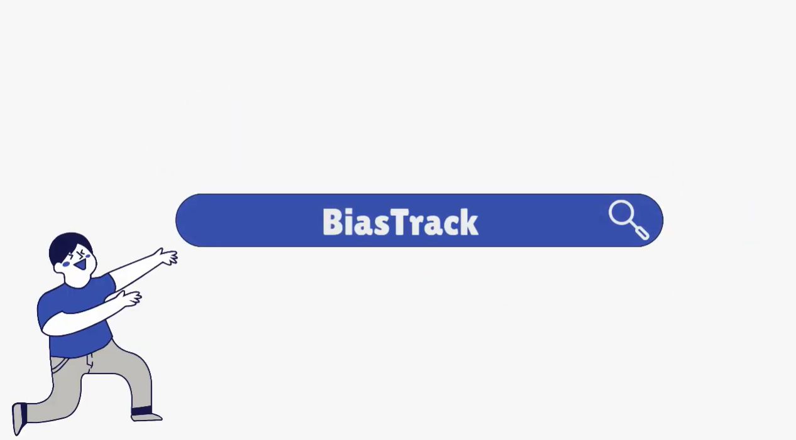
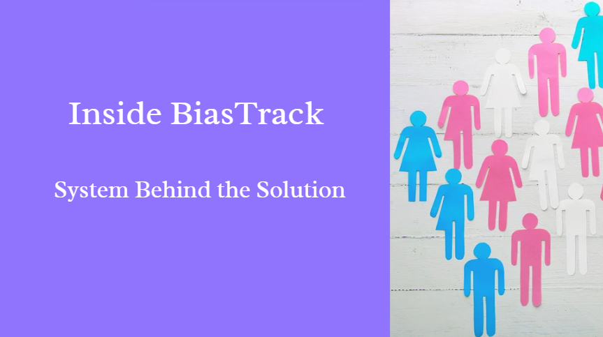

## SECTION 1 : PROJECT TITLE
## BiasTrack: Correcting Gender Pay Gaps Before They Widen

---

## SECTION 2 : EXECUTIVE SUMMARY

The gender pay gap remains one of the most persistent challenges in workplaces across the globe — and Singapore is no exception. Even with progressive employment guidelines and growing awareness of pay transparency, the Ministry of Manpower’s latest figures report an adjusted gender pay gap of around 6%. This means that even after accounting for factors such as occupation and education, women continue to earn less than men for comparable roles. As two women in technology ourselves, this issue resonates deeply with us, motivating the creation of **BiasTrack** — an intelligent reasoning system designed to detect, explain, and address pay inequities through data-driven insight.

While existing platforms such as *Ravio*, *Syndio*, and *Gapsquare* provide benchmarking and compliance reporting, they often fall short of offering **transparent reasoning** or **scenario-based simulation** under real organizational constraints. We envisioned *BiasTrack* as a bridge between analytics and action — a tool that not only identifies disparities but also empowers decision-makers to understand *why* they occur and *how* they can be corrected responsibly.

Our system integrates machine learning, explainable AI, and optimization techniques in one cohesive workflow. It detects pay gaps through regression-based models, translates complex findings into plain-language explanations using Natural Language Generation, and simulates “what-if” scenarios that allow HR teams to explore the impact of proposed adjustments. Constraint-based optimization then recommends equitable salary revisions that respect budget, hierarchy, and role limitations — providing a holistic and practical approach to pay equity.

Built using techniques from the Intelligent Reasoning Systems module, BiasTrack applies reasoning, transparency, and fairness principles to real-world social data. We utilized the Glassdoor Gender Pay Gap dataset, which provided diverse insights into compensation across roles, experience levels, and genders. This dataset served as the foundation for model training, evaluation, and reasoning, enabling us to simulate realistic workplace pay dynamics. Beyond the technical achievement, this project reflects our belief that technology can — and should — play a transformative role in promoting workplace equality.

In essence, **BiasTrack** is more than a proof of concept. It represents our shared conviction as women technologists that fairness must be engineered into the systems that shape our professional world. With continued development, BiasTrack can evolve into a comprehensive fairness intelligence tool, enabling organizations to identify, reason about, and actively close pay gaps before they widen.

---

## SECTION 3 : CREDITS / PROJECT CONTRIBUTION

| **Official Full Name**         | **Student ID** | **Work Items**                                                                                                                                                                                                                                                                                                                                                                                            | **Email**                                            |
| :----------------------------- | :-------------------------------: | :----------------------------------------------------------------------------------------------------------------------------------------------------------------------------------------------------------------------------------------------------------------------------------------------------------------------------------------------------------------------------------------------------------------------- | :-------------------------------------------------------------- |
| **Arshi Saxena**               |             A0331999J             | • Ideation • Research on gender pay gap laws, trends, and statistics • Defined detailed problem scope and functionalities  • System architecture and module design • Data preprocessing and feature engineering (Model 2) • Model 2 development, evaluation, and optimization • Documentation  • Video creation  • Project management and integration | [e1582855@u.nus.edu](mailto:e1582855@u.nus.edu)                 |
| **Pranjali Rajendra Sonawane** |             A0326167B             | • Ideation • Research on existing market solutions and tool comparisons • Workflow design and functional flow mapping • Frontend dashboard design and implementation • Data preprocessing and feature engineering (Model 1) • Model 1 development, evaluation, and optimization  • Documentation  • Video creation  • Project management and integration                                          | [pranjalisonawane@u.nus.edu](mailto:pranjalisonawane@u.nus.edu) |

---

## SECTION 4 : VIDEO OF SYSTEM MODELLING & USE CASE DEMO

---

## SECTION 5 : INSTALLATION AND USER GUIDE
[View Installation & User Guide](ProjectReport/Installation_and_User_Guide.pdf)

---
## SECTION 6 : PROJECT REPORT

[View Project Report](ProjectReport/Project_Report.pdf)
